# DRBD Adapter

## Overview

`entrypoint.adapter.sh` wraps around the official containerized DRBD kernel module loader script `entry.sh` to achieve the following goals:

1. Adapt host OS type automatically;
2. Drop drbd kernel modules and drbd-utils to the host;
3. Use pre-built kernel modules for stock RHEL/CentOS hosts;
4. Use dynamically built kernel modules for un-stock RHEL/CentOS hosts and Ubuntu hosts.


* Yellow: LINBIT's logic
* Blue: DaoCloud's Logic

## Official DRBD Docker Images

LINBIT/drbd <https://github.com/LINBIT/drbd/tree/drbd-9.1/docker>

## Arch Support

* x86_64

## DRBD Versions

* DRBD: v9.0.32-1
* DRBD Utils: v9.12.1

## OS Distro Support

* RHEL/CentOS 7
* RHEL/CentOS 8
* Kylin V10
* Ubuntu 18 Bionic
* Ubuntu 20 Focal

### Not Supported, but for test only

* Ubuntu 22 Jammy (will install DRBD v9.1.10 )

## Kubernetes Version

* 18+

## DRBD Version:
* v9.1.8

## Guide

### Dependency
For dynamically built kernels, the host must have kernel source installed.
```
# RHEL/CentOS
$ yum install -y kernel-devel-$(uname -r)

# Ubuntu
$ apt-get install -y linux-headers-$(uname -r)
```

### Deploy by Helm Charts
Deploy the below `DaemonSet`. It will bring up a pod on each kubernetes worker node to install DRBD modules and tools:

```
$ helm repo add hwameistor https://hwameistor.io/hwameistor

$ helm repo update hwameistor

$ helm pull hwameistor/drbd-adapter --untar

$ helm install drbd-adapter ./drbd-adapter -n hwameistor --create-namespace
```

### Set OS Distros

By default, OS distros are auto-detected by helm `lookup` function.

However, it can be overridden by adding values to the array `distros: []` in `values.yaml`.

**Distros that are not supported will be ignored.**

For example:

```yaml
distros: 
- rhel7
- rhel8
- bionic
#- focal
```

### Post-installation Check

On POD hosts

```console
$ cat /proc/drbd

$ modinfo drbd

$ lsmod | grep drbd

$ drbdadm --version
```
